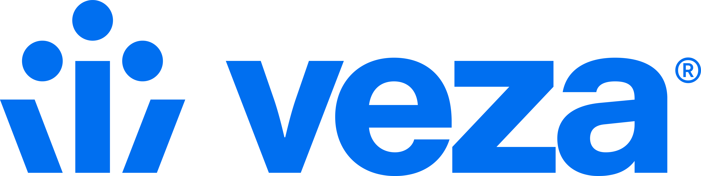
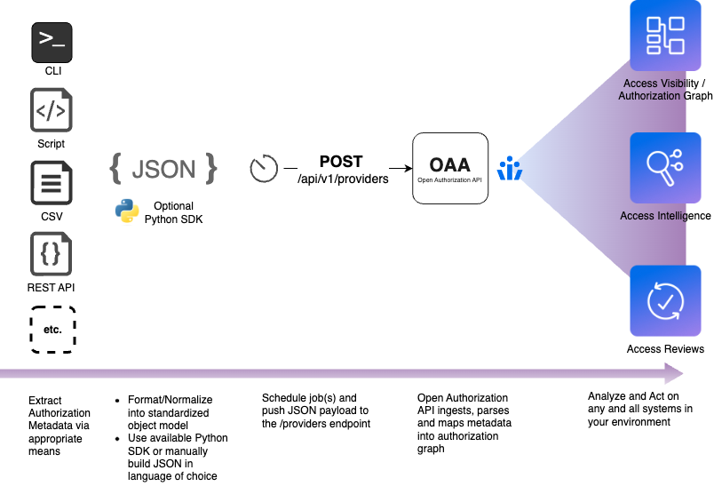

## Veza Overview

[Veza](https://www.veza.com) is an identity security platform that allows organizations to dynamically visualize, understand and control who can and should take what action on what resource. We organize authorization metadata across identity providers, HRIS, IAM, SaaS, apps, data systems, and more — to help organizations with critical use cases of access governance, privileged access monitoring, cloud access management, data system access and SaaS access security.

Veza's catalog of integrations natively support a majority of cloud and on-prem systems. With over 250 integrations and growing, Veza helps you connect all the systems in your environment to provide the [Access Search](https://veza.com/product/access-search/) capability, centered around the "Authorization Graph," which links all entities of all systems in your environment. This helps organizations visualize and control who has access to data across all enterprise systems, reveal granular resource permissions for all identities (human & machine) and help security teams reduce risk before and after attacks.

Veza's Authorization Graph can extend to custom in-house systems, such as homegrown applications, legacy apps, on-prem databases, and vendor (and 3rd party) solutions that aren't natively supported yet. This is accomplished via a standard interface, called the Open Authorization API, or OAA.

## Open Authorization API

The Open Authorization API (OAA) is used to publish information about identities, authorization, and resources to the Veza Authorization Graph, making custom-built or otherwise-unsupported applications available for search, workflows, and monitoring. The OAA connector has 3 jobs: it needs to pull authorization data from the target system (i.e., SaaS app, data storage system, or custom software, etc.), transform that data into a format Veza understands, and call the Veza API to import the data into Veza. 

> Open Authorization API is not currently associated with any open source bodies (IETF, etc.). We will be working with various teams to pursue open standards over course of time. All OAA resources in this repository are licensed under the MIT license.

## How OAA Works
OAA works by providing a mechanism to upload authorization information from a target system to Veza in a standardized
format. To integrate a new system, you utilize that system's API (or other interfaces) to enumerate the identities,
permissions and resources that you want available in Veza. This information must then be formatted according to the OAA
JSON schema and uploaded to Veza using the OAA REST API.

Veza processes this schema mapping to integrate metadata from the new target system into its Authorization Metadata
Graph, which maps which identities have what permissions to what resources. Veza combines this information with
discovered data from Identity providers to expand group memberships and correlate identities. Identities can be local to
that application or linked to external Identity Providers (IdP) like Okta or AzureAD. The Veza schema can capture and
represent both standard Effective Permissions (Create, Read, Update, and Delete) as well as system-specific permissions
(like “Admin” or “Operator”).

Once a target application or system is integrated via OAA into Veza, it acts like any other data source. OAA-integrated
systems are fully available for the purpose of Veza search, governance workflows, reports, alerts, and more.

## Working with OAA
Customers have the choice of integrating with the Open Authorization API directly through REST or leveraging the [Python
SDK](https://github.com/Veza/oaaclient-py). Customers who choose the REST option can develop in any language they like to collect the authorization data, format the OAA template and make REST calls.

**To start developing with OAA, visit the developer documentation site: [developer.veza.com](https://developer.veza.com)**
